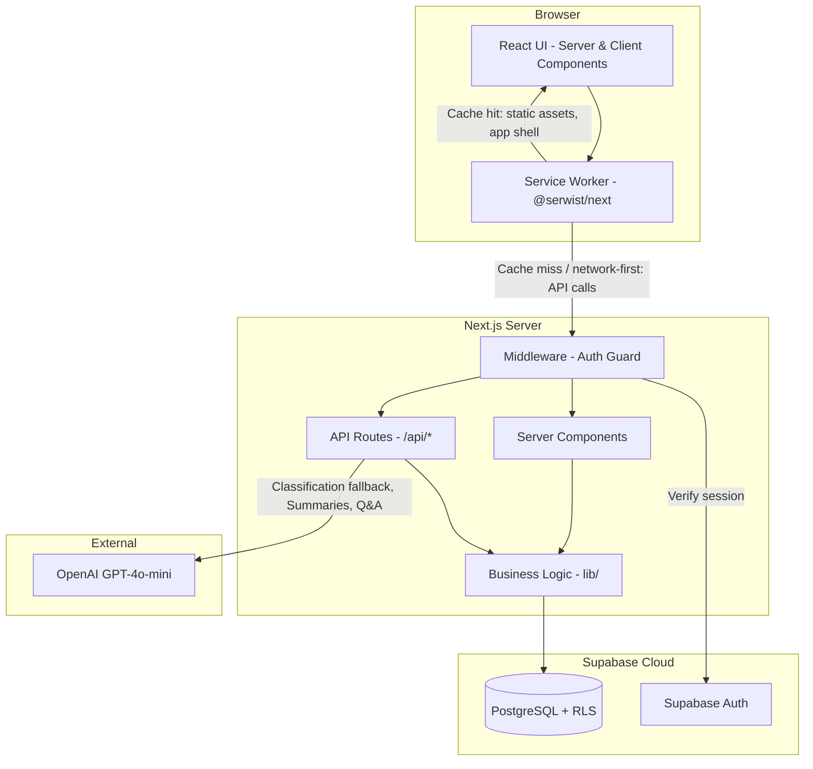
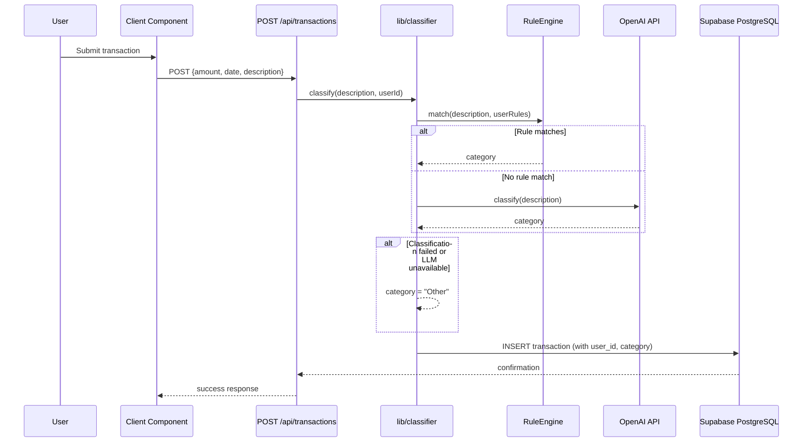
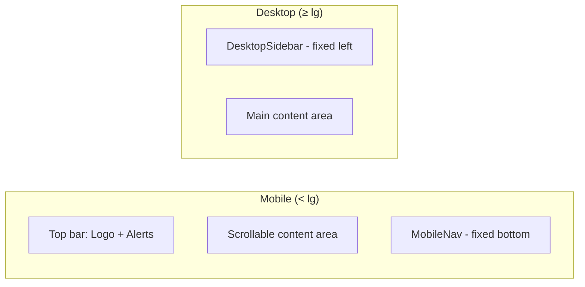

# Design Document: AI Budgeting Assistant

## Overview

The AI Budgeting Assistant is a commercial-ready, multi-user personal finance application built with Next.js 14 (App Router) and Supabase. It provides expense classification, budget creation, spending analysis, and natural-language financial Q&A. User data is stored securely in Supabase PostgreSQL with Row Level Security (RLS) ensuring complete data isolation between users. LLM API calls are handled server-side via Next.js API routes, keeping API keys unexposed to the client.

**Key Design Decisions:**

| Decision | Choice | Rationale |
|----------|--------|-----------|
| Framework | Next.js 14 (App Router) | SSR, API routes, middleware for auth, production deployment |
| Database | Supabase PostgreSQL | Cloud-hosted, RLS for multi-user isolation, real-time capable |
| Authentication | Supabase Auth | Email/password, handles sessions/tokens, integrates with RLS |
| LLM calls | Server-side (API routes) | API keys never reach the client |
| LLM provider | OpenAI GPT-4o-mini | $0.15/M input tokens, $0.60/M output — lowest cost for quality |
| Classification | Rule-based with LLM fallback | 80%+ transactions classified locally at zero cost |
| Charting | Chart.js | Lightweight (~92 KB gzip), 10+ chart types, browser-native canvas |
| CSV parsing | PapaParse | Battle-tested, streaming support for large files |
| Styling | Tailwind CSS | Rapid UI development, works seamlessly with Next.js |
| Testing | Vitest + fast-check | Fast test runner with property-based testing support |
| PWA | @serwist/next | Installable app from any browser (iOS Safari, Android Chrome, desktop) with offline support |
| Layout | Mobile-first with bottom navigation | Optimized for phone use; Tailwind mobile-first breakpoints |

## Architecture

The application follows a layered architecture with Next.js App Router handling both server and client concerns. The database lives in Supabase with RLS policies ensuring each user only accesses their own data. LLM interactions happen exclusively on the server.



### Service Worker Lifecycle

The service worker (managed by `@serwist/next`) sits between the browser and the network, intercepting requests and applying caching strategies:

1. **Install** — On first visit (or app update), the service worker pre-caches the app shell: HTML pages, JS bundles, CSS, static images, icons, and the offline fallback page.
2. **Activate** — Old caches from previous versions are pruned. The new service worker takes control of all open tabs.
3. **Fetch interception** — Each outbound request is evaluated against caching strategies:
   - **Static assets** (JS, CSS, images, fonts): Cache-first with versioned cache keys. Stale content served instantly; background fetch updates the cache.
   - **App shell pages** (navigation requests): Stale-while-revalidate. Cached page shown immediately; fresh version fetched in background for next load.
   - **API calls** (`/api/*`): Network-first with 5-second timeout. Falls back to cached response if available, otherwise returns offline fallback.
   - **Supabase Auth endpoints**: Network-only (never cached, to ensure token freshness).
4. **Offline fallback** — When all strategies fail (no network, no cache), the service worker serves `/offline.html` with a friendly message and retry button.

### Layer Responsibilities

1. **UI Layer (Client Components)** — Interactive forms, charts (Chart.js), file uploads, real-time feedback. Uses `"use client"` only where interactivity is required.
2. **Server Components** — Data fetching, dashboard rendering, budget displays. Fetch data directly from Supabase with user context.
3. **API Routes (`app/api/`)** — LLM orchestration, classification endpoint, CSV processing. All secrets stay server-side.
4. **Middleware** — Auth session validation on every request. Redirects unauthenticated users to login.
5. **Business Logic (`lib/`)** — Classification engine, budget calculator, spending analyser, alert engine, CSV import/export. Pure functions where possible, database calls via Supabase client.
6. **Data Layer (Supabase)** — PostgreSQL with RLS policies. UUID primary keys. All tables include `user_id` foreign key linked to `auth.users`.

### Data Flow: Transaction Classification



## Components and Interfaces

### Module Structure (Next.js App Router)

```
src/
├── app/                          # Next.js App Router
│   ├── layout.tsx                # Root layout with auth provider, viewport meta, PWA meta
│   ├── page.tsx                  # Landing/marketing page (public)
│   ├── manifest.ts               # Next.js metadata API — generates /manifest.webmanifest
│   ├── sw.ts                     # Service worker entry (compiled by @serwist/next)
│   ├── offline/page.tsx          # Offline fallback page
│   ├── (auth)/                   # Auth route group (public)
│   │   ├── login/page.tsx
│   │   ├── signup/page.tsx
│   │   └── layout.tsx
│   ├── (dashboard)/              # Protected route group
│   │   ├── layout.tsx            # Dashboard shell with nav + alerts + MobileNav
│   │   ├── page.tsx              # Main dashboard (server component)
│   │   ├── transactions/page.tsx # Transaction list & input
│   │   ├── budget/page.tsx       # Budget creation & comparison
│   │   ├── analysis/page.tsx     # Spending patterns
│   │   ├── savings/page.tsx      # Savings goals & recommendations
│   │   ├── qa/page.tsx           # Natural-language Q&A
│   │   └── settings/page.tsx     # Data export, deletion, disclaimer
│   └── api/                      # Server-side API routes
│       ├── transactions/
│       │   ├── route.ts          # POST (create), GET (list)
│       │   └── [id]/route.ts     # PATCH (update category), DELETE
│       ├── classify/route.ts     # POST - LLM classification endpoint
│       ├── budget/route.ts       # POST (generate), GET, PATCH
│       ├── analysis/route.ts     # GET - spending analysis
│       ├── summary/route.ts      # GET - financial summary (LLM)
│       ├── qa/route.ts           # POST - natural-language Q&A (LLM)
│       ├── csv/
│       │   ├── import/route.ts   # POST - CSV upload & parse
│       │   └── export/route.ts   # GET - CSV download
│       ├── savings/route.ts      # CRUD for savings goals
│       ├── commitments/route.ts  # CRUD for financial commitments
│       └── alerts/route.ts       # GET - active alerts
├── lib/                          # Business logic (server-side)
│   ├── classifier.ts             # Rule engine + LLM fallback
│   ├── budgetEngine.ts           # Budget creation and allocation
│   ├── spendingAnalyser.ts       # Pattern detection, anomalies
│   ├── alertEngine.ts            # Budget alert generation
│   ├── savingsAdvisor.ts         # Savings recommendations
│   ├── summaryGenerator.ts       # Financial summary builder
│   ├── qaEngine.ts               # Natural-language Q&A handler
│   ├── csvService.ts             # Import/export CSV handling
│   ├── llmClient.ts              # OpenAI API wrapper with cost controls
│   └── validation.ts             # Input validation (shared)
├── components/                   # React UI components
│   ├── layout/                   # Layout components
│   │   ├── MobileNav.tsx         # Bottom tab navigation bar (client)
│   │   ├── DesktopSidebar.tsx    # Sidebar navigation for lg+ screens
│   │   └── InstallPrompt.tsx     # PWA install banner/button (client)
│   ├── dashboard/                # Dashboard widgets
│   ├── transactions/             # Transaction input, list, CSV upload
│   ├── budget/                   # Budget views
│   ├── charts/                   # Chart.js wrapper components (client)
│   ├── analysis/                 # Spending pattern displays
│   ├── qa/                       # Q&A chat interface (client)
│   └── ui/                       # Shared UI (alerts, disclaimer, layout)
├── lib/supabase/                 # Supabase client utilities
│   ├── server.ts                 # Server-side Supabase client (cookies)
│   ├── client.ts                 # Browser-side Supabase client
│   ├── middleware.ts             # Auth middleware helper
│   └── types.ts                  # Generated database types
├── models/                       # TypeScript types and validation schemas
│   ├── transaction.ts
│   ├── budget.ts
│   ├── category.ts
│   ├── savingsGoal.ts
│   ├── commitment.ts
│   └── alert.ts
├── utils/                        # Shared utilities
│   ├── dateUtils.ts              # Budget period calculations
│   └── formatters.ts             # Currency, percentage formatting
├── config/                       # Application configuration
│   └── categories.ts             # Category definitions and rules
└── middleware.ts                 # Next.js middleware (auth guard)

public/
├── icons/                        # PWA app icons
│   ├── icon-192x192.png          # Standard Android home screen
│   ├── icon-512x512.png          # Splash screen / install banner
│   ├── icon-maskable-192x192.png # Maskable icon for adaptive shapes
│   └── icon-maskable-512x512.png # Maskable icon large
├── offline.html                  # Static offline fallback (no JS required)
└── apple-touch-icon.png          # iOS home screen icon (180x180)

next.config.js                    # Includes @serwist/next plugin configuration
```

### Key Interfaces

```typescript
// Core domain types (UUID primary keys, user_id for RLS)
interface Transaction {
  id: string;              // UUID
  user_id: string;         // FK to auth.users
  amount: number;          // 0.01 to 999,999,999.99
  date: string;            // ISO 8601 YYYY-MM-DD
  description: string;     // 1-255 chars
  category: Category;
  type: 'income' | 'expense';
  source?: string;         // For income entries
  is_manual_category: boolean;
  created_at: string;      // ISO 8601 timestamp
}

type Category =
  | 'Housing' | 'Transport' | 'Groceries' | 'Utilities'
  | 'Entertainment' | 'Dining' | 'Health' | 'Shopping'
  | 'Subscriptions' | 'Other';

interface Budget {
  id: string;              // UUID
  user_id: string;         // FK to auth.users
  period_type: 'weekly' | 'monthly';
  period_start: string;    // ISO 8601 date
  period_end: string;      // ISO 8601 date
  total_income: number;
  allocations: CategoryAllocation[];
  created_at: string;
}

interface CategoryAllocation {
  category: Category;
  amount: number;
  is_fixed: boolean;       // True for commitments
}

interface SavingsGoal {
  id: string;              // UUID
  user_id: string;         // FK to auth.users
  target_amount: number;   // 0.01 to 999,999,999.99
  deadline?: string;       // ISO 8601 date, optional
  current_amount: number;
  monthly_contribution: number;
  created_at: string;
}

interface FinancialCommitment {
  id: string;              // UUID
  user_id: string;         // FK to auth.users
  description: string;
  amount: number;          // 0.01 to 999,999,999.99
  frequency: 'weekly' | 'fortnightly' | 'monthly' | 'yearly';
  category: Category;
  created_at: string;
}

interface SpendingAlert {
  id: string;              // UUID
  user_id: string;         // FK to auth.users
  category: Category;
  type: 'warning' | 'exceeded';
  amount_spent: number;
  budgeted_amount: number;
  period_start: string;
  created_at: string;
}

// Service interfaces
interface ClassificationResult {
  category: Category;
  source: 'rule' | 'llm' | 'fallback';
  confidence?: number;
}

interface ClassificationRule {
  pattern: RegExp;
  category: Category;
  priority: number;
}

interface BudgetComparison {
  category: Category;
  budgeted: number;
  actual: number;
  variance: number;        // actual - budgeted
  status: 'under' | 'on-track' | 'over';
}

interface SpendingAnomaly {
  transaction: Transaction;
  categoryAverage: number;
  multiple: number;        // How many times the average
}

interface CategoryTrend {
  category: Category;
  previousAmount: number;
  currentAmount: number;
  percentageChange: number;
}
```

### Classifier Service

```typescript
interface IClassifier {
  classify(description: string, userId: string): Promise<ClassificationResult>;
  addUserCorrection(userId: string, description: string, category: Category): Promise<void>;
  getRules(userId: string): Promise<ClassificationRule[]>;
}
```

The classifier uses a three-tier strategy:
1. **User corrections** — exact match lookup against stored corrections for this user (highest priority)
2. **Rule-based matching** — regex patterns against known merchant/description patterns
3. **LLM fallback** — send description to GPT-4o-mini for classification (only when rules fail, server-side only)

### LLM Client (Server-Side Only)

```typescript
interface ILLMClient {
  classifyTransaction(description: string): Promise<Category | null>;
  generateSummary(data: SummaryInput): Promise<string>;
  answerQuestion(question: string, context: FinancialContext): Promise<string>;
  isAvailable(): boolean;
}
```

The LLM client includes:
- Request timeout (10 seconds)
- Graceful degradation when API is unavailable
- Token usage tracking for cost monitoring
- System prompts that constrain output to valid categories
- **Runs exclusively in API routes — never exposed to client**

## Data Models

### PostgreSQL Schema (Supabase)

```sql
-- Transactions table
CREATE TABLE transactions (
  id UUID PRIMARY KEY DEFAULT gen_random_uuid(),
  user_id UUID NOT NULL REFERENCES auth.users(id) ON DELETE CASCADE,
  amount NUMERIC(12, 2) NOT NULL CHECK (amount >= 0.01 AND amount <= 999999999.99),
  date DATE NOT NULL,
  description TEXT NOT NULL CHECK (char_length(description) BETWEEN 1 AND 255),
  category TEXT NOT NULL DEFAULT 'Other',
  type TEXT NOT NULL CHECK (type IN ('income', 'expense')),
  source TEXT CHECK (source IS NULL OR char_length(source) <= 255),
  is_manual_category BOOLEAN NOT NULL DEFAULT false,
  created_at TIMESTAMPTZ NOT NULL DEFAULT now()
);

-- Indexes for common queries
CREATE INDEX idx_transactions_user_date ON transactions(user_id, date DESC);
CREATE INDEX idx_transactions_user_category ON transactions(user_id, category);
CREATE INDEX idx_transactions_user_date_range ON transactions(user_id, date) WHERE type = 'expense';

-- Row Level Security
ALTER TABLE transactions ENABLE ROW LEVEL SECURITY;
CREATE POLICY "Users can only access own transactions"
  ON transactions FOR ALL
  USING (auth.uid() = user_id)
  WITH CHECK (auth.uid() = user_id);

-- Budgets table
CREATE TABLE budgets (
  id UUID PRIMARY KEY DEFAULT gen_random_uuid(),
  user_id UUID NOT NULL REFERENCES auth.users(id) ON DELETE CASCADE,
  period_type TEXT NOT NULL CHECK (period_type IN ('weekly', 'monthly')),
  period_start DATE NOT NULL,
  period_end DATE NOT NULL,
  total_income NUMERIC(12, 2) NOT NULL,
  allocations JSONB NOT NULL DEFAULT '[]',
  created_at TIMESTAMPTZ NOT NULL DEFAULT now()
);

CREATE INDEX idx_budgets_user_period ON budgets(user_id, period_start, period_end);

ALTER TABLE budgets ENABLE ROW LEVEL SECURITY;
CREATE POLICY "Users can only access own budgets"
  ON budgets FOR ALL
  USING (auth.uid() = user_id)
  WITH CHECK (auth.uid() = user_id);

-- Savings goals table
CREATE TABLE savings_goals (
  id UUID PRIMARY KEY DEFAULT gen_random_uuid(),
  user_id UUID NOT NULL REFERENCES auth.users(id) ON DELETE CASCADE,
  target_amount NUMERIC(12, 2) NOT NULL CHECK (target_amount >= 0.01 AND target_amount <= 999999999.99),
  deadline DATE,
  current_amount NUMERIC(12, 2) NOT NULL DEFAULT 0,
  monthly_contribution NUMERIC(12, 2) NOT NULL DEFAULT 0,
  created_at TIMESTAMPTZ NOT NULL DEFAULT now()
);

ALTER TABLE savings_goals ENABLE ROW LEVEL SECURITY;
CREATE POLICY "Users can only access own savings goals"
  ON savings_goals FOR ALL
  USING (auth.uid() = user_id)
  WITH CHECK (auth.uid() = user_id);

-- Financial commitments table
CREATE TABLE commitments (
  id UUID PRIMARY KEY DEFAULT gen_random_uuid(),
  user_id UUID NOT NULL REFERENCES auth.users(id) ON DELETE CASCADE,
  description TEXT NOT NULL CHECK (char_length(description) BETWEEN 1 AND 255),
  amount NUMERIC(12, 2) NOT NULL CHECK (amount >= 0.01 AND amount <= 999999999.99),
  frequency TEXT NOT NULL CHECK (frequency IN ('weekly', 'fortnightly', 'monthly', 'yearly')),
  category TEXT NOT NULL DEFAULT 'Other',
  created_at TIMESTAMPTZ NOT NULL DEFAULT now()
);

ALTER TABLE commitments ENABLE ROW LEVEL SECURITY;
CREATE POLICY "Users can only access own commitments"
  ON commitments FOR ALL
  USING (auth.uid() = user_id)
  WITH CHECK (auth.uid() = user_id);

-- Spending alerts table
CREATE TABLE spending_alerts (
  id UUID PRIMARY KEY DEFAULT gen_random_uuid(),
  user_id UUID NOT NULL REFERENCES auth.users(id) ON DELETE CASCADE,
  category TEXT NOT NULL,
  type TEXT NOT NULL CHECK (type IN ('warning', 'exceeded')),
  amount_spent NUMERIC(12, 2) NOT NULL,
  budgeted_amount NUMERIC(12, 2) NOT NULL,
  period_start DATE NOT NULL,
  created_at TIMESTAMPTZ NOT NULL DEFAULT now()
);

CREATE INDEX idx_alerts_user_period ON spending_alerts(user_id, period_start);

ALTER TABLE spending_alerts ENABLE ROW LEVEL SECURITY;
CREATE POLICY "Users can only access own alerts"
  ON spending_alerts FOR ALL
  USING (auth.uid() = user_id)
  WITH CHECK (auth.uid() = user_id);

-- Classification rules (user corrections) table
CREATE TABLE classification_rules (
  id UUID PRIMARY KEY DEFAULT gen_random_uuid(),
  user_id UUID NOT NULL REFERENCES auth.users(id) ON DELETE CASCADE,
  description TEXT NOT NULL,
  category TEXT NOT NULL,
  created_at TIMESTAMPTZ NOT NULL DEFAULT now(),
  UNIQUE(user_id, description)
);

ALTER TABLE classification_rules ENABLE ROW LEVEL SECURITY;
CREATE POLICY "Users can only access own classification rules"
  ON classification_rules FOR ALL
  USING (auth.uid() = user_id)
  WITH CHECK (auth.uid() = user_id);
```

### Budget Period Calculation

- **Monthly**: 1st to last day of calendar month
- **Weekly**: Monday to Sunday

### Category Rules Data Structure

```typescript
const DEFAULT_RULES: ClassificationRule[] = [
  { pattern: /rent|mortgage|landlord/i, category: 'Housing', priority: 10 },
  { pattern: /uber|lyft|bus|train|metro|fuel|petrol|gas station/i, category: 'Transport', priority: 10 },
  { pattern: /woolworths|coles|aldi|lidl|tesco|kroger|safeway/i, category: 'Groceries', priority: 10 },
  { pattern: /electric|water|gas bill|internet|phone bill/i, category: 'Utilities', priority: 10 },
  { pattern: /netflix|spotify|disney|hbo|youtube premium/i, category: 'Subscriptions', priority: 10 },
  { pattern: /restaurant|cafe|coffee|starbucks|mcdonald/i, category: 'Dining', priority: 8 },
  { pattern: /cinema|movie|concert|theatre|game|steam/i, category: 'Entertainment', priority: 8 },
  { pattern: /pharmacy|doctor|hospital|dentist|physio/i, category: 'Health', priority: 8 },
  { pattern: /amazon|ebay|zara|h&m|target|mall/i, category: 'Shopping', priority: 6 },
  // ... extensible
];
```

### Budget Allocation Algorithm

```
1. Calculate available_income = total_income - sum(commitments_for_period) - savings_contribution
2. IF available_income <= 0: report shortfall, stop
3. IF historical_data_exists (query user's transactions from Supabase):
     For each category: allocation = (category_historical_spend / total_historical_spend) * available_income
4. ELSE (50/30/20 heuristic):
     needs_categories (Housing, Transport, Groceries, Utilities, Health) = 50% of available_income
     wants_categories (Entertainment, Dining, Shopping, Subscriptions) = 30% of available_income
     savings = 20% of available_income (added to Savings_Goal contribution)
5. Round allocations to 2 decimal places, adjust largest category to eliminate rounding error
```

### Alert Generation Logic

```
On each transaction insert (server-side, in API route):
1. Get current budget for the active period (filtered by user_id via RLS)
2. IF no budget exists: skip
3. Calculate total spending for the transaction's category in current period
4. IF spending >= budgeted_amount AND no 'exceeded' alert exists for this category/period/user:
     Create 'exceeded' alert
5. ELSE IF spending >= 0.8 * budgeted_amount AND no 'warning' alert exists:
     Create 'warning' alert
```

## PWA & Mobile Experience

### Web App Manifest

The app uses the Next.js Metadata API (`src/app/manifest.ts`) to generate a web app manifest at `/manifest.webmanifest`:

```typescript
// src/app/manifest.ts
import type { MetadataRoute } from 'next';

export default function manifest(): MetadataRoute.Manifest {
  return {
    name: 'AI Budgeting Assistant',
    short_name: 'Budget AI',
    description: 'AI-powered personal budgeting assistant',
    start_url: '/',
    display: 'standalone',
    background_color: '#ffffff',
    theme_color: '#1e40af',        // Tailwind blue-800
    orientation: 'portrait-primary',
    icons: [
      { src: '/icons/icon-192x192.png', sizes: '192x192', type: 'image/png' },
      { src: '/icons/icon-512x512.png', sizes: '512x512', type: 'image/png' },
      { src: '/icons/icon-maskable-192x192.png', sizes: '192x192', type: 'image/png', purpose: 'maskable' },
      { src: '/icons/icon-maskable-512x512.png', sizes: '512x512', type: 'image/png', purpose: 'maskable' },
    ],
  };
}
```

### Service Worker Configuration (@serwist/next)

```javascript
// next.config.js
const withSerwist = require('@serwist/next').default({
  swSrc: 'src/app/sw.ts',
  swDest: 'public/sw.js',
  cacheOnNavigation: true,
  reloadOnOnline: true,
});

/** @type {import('next').NextConfig} */
const nextConfig = {
  // existing Next.js config
};

module.exports = withSerwist(nextConfig);
```

```typescript
// src/app/sw.ts
import { defaultCache } from '@serwist/next/worker';
import { Serwist } from 'serwist';

const serwist = new Serwist({
  precacheEntries: self.__SW_MANIFEST,   // Auto-generated precache list
  skipWaiting: true,
  clientsClaim: true,
  navigationPreload: true,
  runtimeCaching: [
    ...defaultCache,
    // Network-first for API routes (fresh data preferred)
    {
      urlPattern: /\/api\/.*/i,
      handler: 'NetworkFirst',
      options: {
        cacheName: 'api-cache',
        networkTimeoutSeconds: 5,
        expiration: { maxEntries: 50, maxAgeSeconds: 60 * 5 },
      },
    },
    // Cache-first for static assets (fonts, images)
    {
      urlPattern: /\.(?:png|jpg|jpeg|svg|gif|webp|woff2?)$/i,
      handler: 'CacheFirst',
      options: {
        cacheName: 'static-assets',
        expiration: { maxEntries: 100, maxAgeSeconds: 60 * 60 * 24 * 30 },
      },
    },
  ],
  fallbacks: {
    entries: [
      { url: '/offline', matcher: ({ request }) => request.destination === 'document' },
    ],
  },
});

serwist.addEventListeners();
```

### Caching Strategy Summary

| Request Type | Strategy | Rationale |
|--------------|----------|-----------|
| App shell (HTML, JS, CSS) | Precache + stale-while-revalidate | Instant load; background updates |
| Static assets (images, fonts, icons) | Cache-first (30-day expiry) | Immutable content, save bandwidth |
| API calls (`/api/*`) | Network-first (5s timeout) | Fresh financial data preferred; fallback to last-known |
| Supabase Auth endpoints | Network-only | Token freshness is critical |
| Offline fallback | Served from precache | Always available even with no connectivity |

### Offline Fallback Page

`public/offline.html` is a lightweight static page (no JS framework required) that:
- Displays a friendly "You're offline" message with the app icon
- Shows the last sync time (stored in localStorage by the app before going offline)
- Provides a "Try Again" button that calls `location.reload()`
- Uses the same theme color and styling as the main app

### Install Prompt (InstallPrompt.tsx)

The `components/layout/InstallPrompt.tsx` component:
1. Listens for the `beforeinstallprompt` event (Chromium browsers)
2. On iOS Safari, detects standalone mode via `navigator.standalone` and shows manual instructions ("Tap Share → Add to Home Screen")
3. Shows a dismissible banner at the bottom of the screen (above MobileNav) with "Install App" CTA
4. Stores dismissal in localStorage — re-prompts after 7 days if not installed
5. Hides automatically once `display-mode: standalone` is detected (app already installed)

### Mobile-First Responsive Design

#### Viewport Configuration

```typescript
// src/app/layout.tsx — metadata export
export const metadata: Metadata = {
  // ...
  viewport: {
    width: 'device-width',
    initialScale: 1,
    maximumScale: 1,         // Prevent zoom on input focus (iOS)
    viewportFit: 'cover',    // Enable safe-area-inset-* on notched devices
  },
  appleWebApp: {
    capable: true,
    statusBarStyle: 'black-translucent',
    title: 'Budget AI',
  },
};
```

#### Tailwind Breakpoint Strategy

All styles are written mobile-first. Base classes target phones (< 640px), then scale up:

| Breakpoint | Width | Target Device |
|------------|-------|---------------|
| (default)  | < 640px | Phones |
| `sm:`      | ≥ 640px | Large phones / small tablets |
| `md:`      | ≥ 768px | Tablets |
| `lg:`      | ≥ 1024px | Laptops / desktops |
| `xl:`      | ≥ 1280px | Large desktops |

**Example pattern:**
```html
<div class="px-4 py-3 sm:px-6 md:px-8 lg:px-12">
  <!-- Content scales padding with screen size -->
</div>
```

#### Safe Area Insets (Notched Devices)

```css
/* global styles or Tailwind @layer */
:root {
  --sat: env(safe-area-inset-top);
  --sar: env(safe-area-inset-right);
  --sab: env(safe-area-inset-bottom);
  --sal: env(safe-area-inset-left);
}
```

Applied to:
- **Dashboard layout**: `padding-top: var(--sat)` for status bar overlap in standalone mode
- **MobileNav**: `padding-bottom: var(--sab)` so bottom nav clears the home indicator
- **Full-bleed content**: `padding-left: var(--sal); padding-right: var(--sar)`

#### Touch-Friendly Inputs

- All interactive elements have a minimum tap target of **44×44px** (`min-h-[44px] min-w-[44px]`)
- Input fields use `text-base` (16px) to prevent iOS auto-zoom on focus
- Button spacing uses `gap-3` minimum between adjacent tap targets
- Swipe gestures are not used for critical actions (accessibility)

#### Bottom Navigation Bar (MobileNav.tsx)

Visible only on screens < `lg` breakpoint. Hidden on desktop where the sidebar is shown.

```typescript
// components/layout/MobileNav.tsx
const NAV_ITEMS = [
  { href: '/',              icon: HomeIcon,          label: 'Home' },
  { href: '/transactions',  icon: ListIcon,          label: 'Transactions' },
  { href: '/budget',        icon: PieChartIcon,      label: 'Budget' },
  { href: '/analysis',      icon: TrendingUpIcon,    label: 'Analysis' },
  { href: '/qa',            icon: MessageCircleIcon,  label: 'Ask AI' },
];
```

Design constraints:
- Fixed to bottom of viewport (`fixed bottom-0 inset-x-0`)
- Height: 64px + safe-area-inset-bottom
- Background: white with top border and subtle shadow
- Active tab indicated by filled icon + primary color
- Labels always visible (no icon-only mode) for accessibility
- `pb-[env(safe-area-inset-bottom)]` for notched devices
- Dashboard content area includes `pb-20` to prevent content hiding behind nav

#### Responsive Chart Configuration

All Chart.js instances use:
```typescript
const chartOptions = {
  responsive: true,
  maintainAspectRatio: false,    // Allows chart to fill container height
  plugins: {
    legend: {
      position: window.innerWidth < 768 ? 'bottom' : 'right',
      labels: { boxWidth: 12, padding: 8 },
    },
  },
};
```

Chart containers use responsive height:
```html
<div class="h-[250px] sm:h-[300px] md:h-[400px] w-full">
  <canvas id="chart" />
</div>
```

#### Layout Architecture (Mobile vs Desktop)



- **Mobile**: Full-width content, no sidebar. Top bar with logo and alert badge. Bottom tab nav.
- **Desktop (lg+)**: 256px fixed sidebar on left. Content fills remaining width. No bottom nav.
- Transition between layouts handled by Tailwind responsive classes (`hidden lg:block` / `lg:hidden`).

## Correctness Properties

*A property is a characteristic or behavior that should hold true across all valid executions of a system — essentially, a formal statement about what the system should do. Properties serve as the bridge between human-readable specifications and machine-verifiable correctness guarantees.*

### Property 1: Transaction validation round trip

*For any* valid transaction data (amount between 0.01–999,999,999.99, date in ISO 8601 not in the future, description 1–255 chars), storing and then retrieving the transaction from the database SHALL produce a record with identical amount, date, description, and category values.

**Validates: Requirements 1.1, 1.2**

### Property 2: Invalid transaction rejection

*For any* transaction data where the amount is outside 0.01–999,999,999.99, or the date is malformed/future, or the description is empty or exceeds 255 characters, the validation function SHALL reject the input and the database SHALL remain unchanged.

**Validates: Requirements 1.4**

### Property 3: CSV parsing preserves valid rows

*For any* CSV string containing N valid rows (each with a valid date, description, and positive amount), parsing SHALL produce exactly N transaction objects with matching field values.

**Validates: Requirements 1.2**

### Property 4: Classification always assigns exactly one category

*For any* non-empty transaction description string, the classification engine SHALL return exactly one Category from the defined set, regardless of whether the source is rule-based, LLM, or fallback.

**Validates: Requirements 2.1, 2.5**

### Property 5: User correction overrides future classification

*For any* transaction description D and category C belonging to a given user, after the user corrects D's category to C, all subsequent calls to classify(D) for that user SHALL return C.

**Validates: Requirements 2.3**

### Property 6: Budget allocations sum to available income

*For any* set of income, commitments, and savings contributions where income exceeds obligations, the generated budget's category allocations SHALL sum to exactly (income - commitments - savings_contribution), within a tolerance of ±0.01 for rounding.

**Validates: Requirements 3.1, 3.2**

### Property 7: Budget modification preserves total

*For any* budget and any single-category modification (increase or decrease), the remaining categories SHALL be redistributed such that the total allocations still equal available income (±0.01 tolerance).

**Validates: Requirements 3.5**

### Property 8: Spending comparison status classification

*For any* category with a budgeted amount B and actual spending A: if A > B then status is "over"; if A >= B × 0.9 and A <= B then status is "on-track"; if A < B × 0.9 then status is "under".

**Validates: Requirements 4.3, 4.4, 4.5**

### Property 9: Anomaly detection threshold

*For any* transaction T in a category with at least 3 prior transactions and an average amount AVG, T SHALL be flagged as unusual if and only if T.amount > 2 × AVG.

**Validates: Requirements 5.2**

### Property 10: Category trend detection

*For any* two consecutive budget periods where a category's spending increased by more than 20%, the spending analyser SHALL include that category in the increasing-spend results.

**Validates: Requirements 5.1**

### Property 11: Savings recommendation with deadline

*For any* savings goal with a remaining amount R and D months until deadline (D > 0), the recommended monthly contribution SHALL equal R / D (rounded to 2 decimal places).

**Validates: Requirements 6.1**

### Property 12: Alert generation at-most-once per type per category per period

*For any* sequence of transactions within a single budget period for a given user, the alert engine SHALL generate at most one warning alert and one exceeded alert per category.

**Validates: Requirements 9.3**

### Property 13: CSV export round trip

*For any* set of stored transactions belonging to a user, exporting to CSV and then re-importing (parsing) the CSV SHALL produce an equivalent set of transactions with matching dates, descriptions, amounts, and categories.

**Validates: Requirements 13.1, 13.2, 13.3, 13.4**

### Property 14: User data isolation

*For any* two distinct users A and B, queries executed in user A's session SHALL never return transactions, budgets, goals, commitments, or alerts belonging to user B.

**Validates: Requirements 12.1**

## Error Handling

### Input Validation Errors

| Scenario | Handling |
|----------|----------|
| Invalid amount (≤0, >999,999,999.99, NaN) | Return 400 with field-level error, do not store |
| Malformed date | Return 400 indicating expected YYYY-MM-DD format |
| Future date | Return 400 stating date cannot be in the future |
| Description too long/empty | Return 400 with character limits |
| CSV row missing fields | Skip row, accumulate error with row number and missing field |
| CSV file too large (>10,000 rows) | Reject file with 413 and descriptive error |

### Authentication & Authorization Errors

| Scenario | Handling |
|----------|----------|
| No session / expired token | Middleware redirects to /login, API routes return 401 |
| Invalid credentials on login | Display "Invalid email or password" (no detail leakage) |
| Auth token refresh failure | Clear session, redirect to login with "session expired" message |
| RLS policy violation (should never happen) | Log server-side error, return 403 to client |
| Email already registered | Display "An account with this email already exists" |

### LLM Service Errors

| Scenario | Handling |
|----------|----------|
| API timeout (>10s) | Assign "Other" category, flag for manual review |
| API key invalid/missing | Degrade gracefully — all classifications fall back to "Other" |
| Rate limit exceeded | Queue request with exponential backoff (max 3 retries) |
| Invalid response format | Assign "Other" category, log the unexpected response |
| Network unavailable from server | Use rule-based only; return response indicating LLM features limited |

### Network & Database Errors

| Scenario | Handling |
|----------|----------|
| Supabase connection failure | Return 503 with "Service temporarily unavailable", show retry UI |
| Database query timeout | Return 504, suggest the user try again |
| Network error (client to server) | Display toast with retry option, preserve form state |
| Supabase rate limiting | Return 429, implement client-side exponential backoff |
| Database constraint violation | Return 409 with descriptive error (e.g., duplicate entry) |

### Budget Calculation Errors

| Scenario | Handling |
|----------|----------|
| Commitments exceed income | Return 422 with shortfall amount, prevent budget creation |
| No historical data for allocation | Fall back to 50/30/20 heuristic |
| Division by zero (no spending) | Distribute equally across categories |

## Testing Strategy

### Unit Tests (Vitest)

- **Validation functions**: Test each field validator with specific valid/invalid examples
- **Budget calculator**: Test allocation logic with known inputs and expected outputs
- **Alert engine**: Test threshold detection with edge cases (exactly 80%, exactly 100%)
- **CSV parser integration**: Test malformed rows, encoding edge cases
- **Date utilities**: Test period boundary calculations
- **Classification rules**: Test regex matching against known descriptions

### Property-Based Tests (fast-check + Vitest)

Property-based testing is appropriate for this feature because:
- The business logic contains pure functions with clear input/output behavior (validation, classification, budget calculation, CSV serialization)
- Universal properties hold across wide input spaces (any valid amount, any description string, any set of allocations)
- The input space is large (amounts, descriptions, date ranges, category combinations)
- Data isolation is a universal property that must hold across all user combinations

**Configuration:**
- Library: [fast-check](https://github.com/dubzzz/fast-check) with Vitest runner
- Minimum 100 iterations per property test
- Each test tagged with: `Feature: ai-budgeting-assistant, Property {N}: {title}`
- Database-dependent properties tested with mocked Supabase client or test database

**Properties to implement:**
1. Transaction validation round trip (Property 1)
2. Invalid transaction rejection (Property 2)
3. CSV parsing preserves valid rows (Property 3)
4. Classification always assigns one category (Property 4)
5. User correction overrides classification (Property 5)
6. Budget allocations sum to available income (Property 6)
7. Budget modification preserves total (Property 7)
8. Spending comparison status classification (Property 8)
9. Anomaly detection threshold (Property 9)
10. Category trend detection (Property 10)
11. Savings recommendation calculation (Property 11)
12. Alert at-most-once per type/category/period (Property 12)
13. CSV export/import round trip (Property 13)
14. User data isolation (Property 14)

### Integration Tests

- Supabase Auth flow: signup → login → session refresh → logout
- Full transaction flow: input → classify (API route) → store → query → export
- RLS isolation: create data as user A, verify user B cannot access it
- LLM client with mocked API responses (server-side)
- Budget creation from historical data end-to-end
- Alert triggering across multiple transaction inserts
- Middleware auth guard: verify unauthenticated requests are redirected/rejected

### Manual Testing

- UI responsiveness and accessibility
- Disclaimer display and acknowledgement flow
- Chart rendering correctness (visual inspection)
- Cross-browser compatibility (Chrome, Firefox, Safari)
- Auth flows: signup, login, password reset, session expiry
- **PWA install flow**: Verify install prompt appears on Android Chrome, desktop browsers; verify iOS Safari "Add to Home Screen" instructions display correctly
- **Standalone mode**: Verify app launches without browser chrome on all platforms after install
- **Offline behaviour**: Disable network, verify offline fallback page displays, verify cached pages still render
- **Service worker update**: Deploy a new version, verify users see updated content after reload
- **Mobile navigation**: Verify bottom nav is visible on mobile, hidden on desktop; verify all tabs navigate correctly
- **Touch targets**: Audit all buttons/links for 44px minimum tap area
- **Safe area insets**: Test on iPhone with notch/Dynamic Island — verify no content is obscured
- **Responsive charts**: Verify charts resize correctly across breakpoints, legends reposition on mobile
- **Viewport zoom**: Confirm text inputs don't trigger iOS zoom (16px minimum font size)
